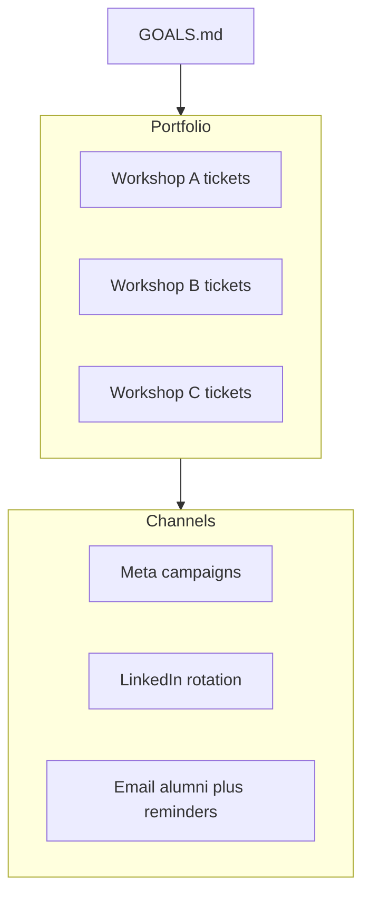

# Sales plan & workshop portfolio goals

This folder holds the **sales playbook** for AI with Michal: goals, KPIs, and tactical docs. **Canonical workshop definitions** (slugs, Stripe prices, landing routes) live in [`lib/workshops.ts`](../lib/workshops.ts). CLI scripts use a duplicate list in [`scripts/workshop-registry.mjs`](../scripts/workshop-registry.mjs)—update both when you add a public workshop.

## This folder

| File | Purpose |
|------|---------|
| [GOALS.md](./GOALS.md) (this file) | Targets, levers, commands, decisions |
| [master-calendar.md](./master-calendar.md) | Overlapping timelines (Meta, LinkedIn, email) |
| [meta-ads-playbook.md](./meta-ads-playbook.md) | Campaign launch, iteration, parallel ads |
| [organic-and-alumni.md](./organic-and-alumni.md) | LinkedIn + alumni 50% Stripe promos |
| [workshop-2026-04-16-ai-in-recruiting.md](./workshop-2026-04-16-ai-in-recruiting.md) | Apr 16 session one-pager |
| [workshop-2026-04-23-sourcing-automation.md](./workshop-2026-04-23-sourcing-automation.md) | Apr 23 session one-pager |
| [workshop-2026-05-07-claude-cowork-recruiting.md](./workshop-2026-05-07-claude-cowork-recruiting.md) | May 7 session one-pager |

## How we work (parallel workshops)

Several workshops can be **on sale at the same time**. Each has its own ticket URL: `https://aiwithmichal.com/workshops/<slug>/tickets` (use `?ref=<source>` for PostHog).

- **Priority:** weight **nearest event date** for urgency creative, but **shift budget** toward workshops farthest below the paid target when multiple Meta lines are live.
- **Meta:** one campaign or clearly named ad set per workshop; review **each** active line on a fixed cadence (see [meta-ads-playbook.md](./meta-ads-playbook.md)).
- **`launch-campaign.mjs`:** defaults in the script may lag `lib/workshops.ts`—pass `--workshop-slug <slug>` explicitly until defaults are aligned.

## Command rhythm

Run these CLIs to monitor and act:

```bash
# Portfolio status — paid orders per upcoming workshop + alerts
node --env-file=.env scripts/status.mjs

# PostHog funnel (global — signups not split per workshop)
node --env-file=.env scripts/analytics.mjs

# Stripe revenue by workshop_slug + tiers
node --env-file=.env scripts/stripe-report.mjs

# Paid attendee reminders (per workshop date — use flags for type)
node --env-file=.env scripts/send-reminders.mjs

# Meta Ads snapshot
node --env-file=.env scripts/meta-ads-stats.mjs

# Meta Ads CLI
node --env-file=.env scripts/meta-ads/index.mjs campaigns list --pretty
node --env-file=.env scripts/meta-ads/index.mjs insights <campaign-id> --preset last_30d --pretty

# Deploy
./scripts/deploy.sh "your commit message"
```

## Portfolio KPIs

**Global** (site-wide funnel — registrations are not attributed per workshop today):

| Metric | Target | Stretch |
|--------|--------|---------|
| Conversion (visitors → paid) | 3% | 5% |
| Pro tier mix (paid) | 50% | 65% |
| Email open rate (reminders) | 45% | 60% |

**Per workshop** — operational target **20 paid tickets** each (stretch optional: raise caps in Stripe/admin if you intentionally sell more). Checkout ceiling is `WORKSHOP_CAPACITY` in `.env` (default **20**); set `NEXT_PUBLIC_WORKSHOP_CAPACITY` to the same value so ticket pages show correct “spots left.”

| Slug | Date | Paid target |
|------|------|-------------|
| `2026-04-16-ai-in-recruiting` | April 16, 2026 | 20 |
| `2026-04-23-sourcing-automation` | April 23, 2026 | 20 |
| `2026-05-07-claude-cowork-recruiting` | May 7, 2026 | 20 |

## Parallel marketing (summary)

- **Meta:** separate landing URL per slug; name campaigns/ad sets so the slug or date is obvious; cap total daily spend or set a per-workshop floor—see playbook.
- **LinkedIn (organic):** rotate posts so every **live** workshop gets visibility; never paste alumni-only promo codes publicly.
- **Alumni 50%:** Stripe coupon or promotion code; email/DM only—see [organic-and-alumni.md](./organic-and-alumni.md).

## Ticket prices

- Basic (workshop): €79  
- Pro (workshop + toolkit): €129 — prefer Pro in copy  
- Capacity: **20** per workshop; `WORKSHOP_CAPACITY` + `NEXT_PUBLIC_WORKSHOP_CAPACITY` in `.env` (see `.env.example`)

## Levers to pull (in order of impact)

1. **Promo codes** — Stripe dashboard; targeted outreach (alumni codes private)
2. **Urgency** — “X spots left” on `/tickets` when &lt;15 remaining for that workshop
3. **Reminders** — `scripts/send-reminders.mjs` (week before / day before / day-of)
4. **Referral links** — `?ref=<source>` on any URL
5. **Social proof** — attendee counts where shown on site

## Decision framework

- **Per workshop:** T-7 → week reminder to paid attendees; T-1 → day-before; day-of → hour-before (see reminder script flags).
- **Conversion &lt; 2% (global):** run `analytics.mjs`, fix funnel or add a time-limited promo.
- **Basic:Pro &gt; 60:40:** strengthen Pro on ticket pages.
- **Registrations high, payments low:** email registered non-payers.
- **&lt;15 spots left** (any workshop): urgency on social + email for **that** slug’s URL.
- **Meta:** pause CTR &lt; 0.5% or spend with no conversions; scale CTR &gt; 3% or clear purchases; treat **each** campaign independently.


